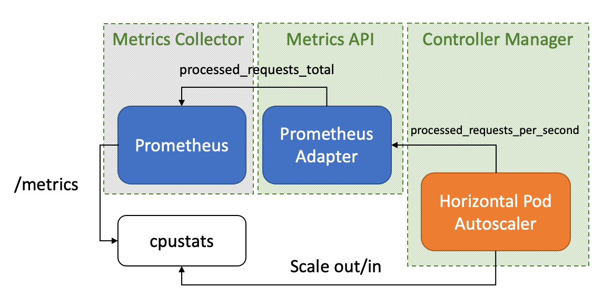

# Kubernetes Horizontal Pod Autoscaler

## Summary

This project was created to demonstrate what components are required
by an application to consume [Kubernetes Horizontal Pod Autoscaler][1]
feature.

The [k6.yml](tests/k6.yml) provides a traffic simulator which
generates virtual users, those users perform HTTP requests against the
web server. The *Prometheus* instance collects custom metrics which
are aggreated by *Prometheus Adapter* and consumed by *Horizontal Pod
Autoscaler*, this last component triggers actions to scale out/in
replicas in order to distribute the workload.

## Virtual Machines

The [Vagrant tool][2] can be used for provisioning an Ubuntu Focal
Virtual Machine. It's highly recommended to use the  *setup.sh* script
of the [bootstrap-vagrant project][3] for installing Vagrant
dependencies and plugins required for this project. That script
supports two Virtualization providers (Libvirt and VirtualBox) which
are determine by the **PROVIDER** environment variable.

    curl -fsSL http://bit.ly/initVagrant | PROVIDER=libvirt bash

Once Vagrant is installed, it's possible to provision a Virtual
Machine using the following instructions:

    vagrant up

The provisioning process will take some time to install all
dependencies required by this project and perform a Kubernetes
deployment on it.

[1]: https://kubernetes.io/docs/tasks/run-application/horizontal-pod-autoscale/
[2]: https://www.vagrantup.com/
[3]: https://github.com/electrocucaracha/bootstrap-vagrant
